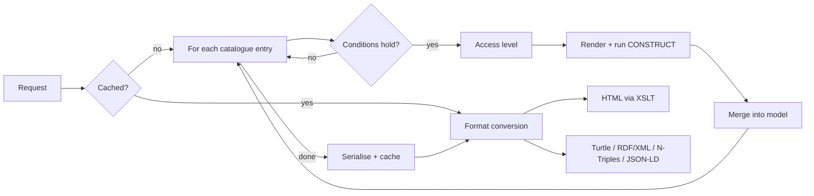

# Request flows

This chapter describes how the predecessor builds a response for its main server-side paths. The literal queries are in the [Query catalogue](query-catalogue.md).

## `/doc/{concept}/{id}`: assembling a document

The predecessor builds a resource description from an **XML query catalogue**. The catalogue lists six query templates, each with optional conditions on the concept and the negotiated media type. For every request:

1. Derive the domain from the host name, and the full `id` and `doc` URIs from the path.
2. Look up the result in a second-level cache, keyed on domain, concept and identifier.
3. On a cache miss, for each catalogue entry whose conditions hold:
    1. determine the caller's access level;
    2. render the query template with the domain, concept and URIs;
    3. run it as a `CONSTRUCT` query on the triple store, with the read-only account for that access level;
    4. merge the result into one RDF model.
4. Serialise the merged model as RDF/XML and store it in the cache.
5. Convert the result to the requested format. HTML is produced by an XSLT transformation of the RDF/XML.

### The six catalogue entries

| # | Query | Intended condition |
|---|---|---|
| 1 | Core description of the resource | always |
| 2 | Provenance ("created with") | always |
| 3 | Literal-valued properties | always |
| 4 | Object properties | always |
| 5 | Incoming relations, full | only for **non-HTML** formats |
| 6 | Incoming relations, restricted | only for **HTML** |

The **intent** behind entries 5 and 6 is profile-dependent behaviour. HTML pages get a lighter, restricted view of incoming relations. Machine formats get the full set.

!!! warning "Intended versus actual behaviour"
    Two independent faults in how the predecessor evaluates these conditions mean that this distinction is **not** in effect: the same set of incoming relations is used for every format. SPieGeL must not copy the predecessor's actual behaviour. It must implement the intended behaviour explicitly, as **content negotiation by profile**, with tests. Whether the restricted HTML view is still wanted is a product decision. → [FR-CN-03](../03-requirements/functional.md#content-negotiation)

### Lessons for SPieGeL

- The query catalogue is **domain logic that lives outside any type system or test**. In SPieGeL it becomes an explicit domain model: a document assembler per resource type, with queries as data and conditions as typed, tested rules.
- The cache key must include everything that determines the response, **including the caller's access level and the profile**. Authorisation must be evaluated before any cache lookup. → [NFR-SEC-03](../03-requirements/non-functional.md#security)
- The cached form is format-independent (RDF). Formatting happens after the cache. That is a good choice to keep.

## `/ns/{model}`: vocabulary page

There is one `CONSTRUCT` query and no catalogue. It returns every resource that is `rdfs:isDefinedBy` the ontology `{base}/id/ontology/{model}` and whose IRI falls inside the namespace `{base}/ns/{model}#`. It unpacks `owl:unionOf` and `owl:intersectionOf` lists so they can be displayed. Caching and authorisation work the same way as for `/doc/`.

## `/sparql`: free-form queries

- The user's query is passed to the triple store **verbatim**.
- Without a query, a per-domain default query is used.
- Write operations are refused in two ways. The database account has read-only rights, and the application also checks queries against a list of update keywords.
- This endpoint is also the back end for all the browser components (see [Client components](client-components.md)).

## `/keywordsearch`: full-text search

Two queries are run per search: a count, then a page of results. Both use the triple store's own full-text index (Virtuoso `bif:contains`). Alternative implementations for Jena (`text:query`) and Blazegraph (`bds:search`) exist in the code but are not routed.

## Domain home page

The home page is a static document per domain, rendered with XSLT. It runs no live query. It offers example SPARQL queries and example search terms, loaded from text files per domain.
