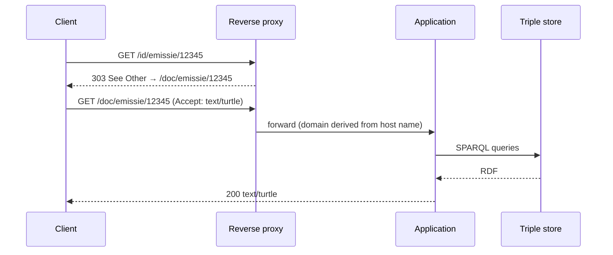

# URI patterns

## The Flemish URI standard

The predecessor's URI shape is not an ad hoc choice. It implements the *Flemish URI standard for data* (Informatie Vlaanderen, version 1.0, 23 March 2017). The standard prescribes:

```
http(s)://{domain}/{type}/{concept}(/{reference})*
```

`{type}` is at least one of:

| Type | Identifies | Example |
|---|---|---|
| `id` | the thing itself (a non-information resource) | `https://data.imjv.omgeving.vlaanderen.be/id/emissie/12345` |
| `doc` | the web document about the thing | `https://data.imjv.omgeving.vlaanderen.be/doc/emissie/12345` |
| `ns` | a vocabulary namespace | `https://data.cbb.omgeving.vlaanderen.be/ns/cbb#Exploitatie` |

A request for an `id` URI must be answered with `303 See Other` to the matching `doc` URI (rules 4.2 to 4.4 of the standard).



In the predecessor, the reverse proxy performs the `303` redirect. The application contains its own implementation as well, but public traffic never reaches it.

## Known gaps

Two places are known where the predecessor does not meet the standard, or a related standard. Both are **functional requirements** for SPieGeL, not nice-to-haves.

### Skolem IRIs are not dereferenceable

The triple store replaces blank nodes with Skolem IRIs of the form:

```
https://data.imjv.omgeving.vlaanderen.be/.well-known/genid/{id}
```

The predecessor has no route for `/.well-known/genid/…`. These IRIs therefore return 404. That breaks the basic Linked Data expectation that URIs resolve. → [FR-URI-04](../03-requirements/functional.md#uri-policy)

### ELI paths do not fit the generic scheme

Legislative and decision resources (such as `besluit` concepts) should also be identified according to the [European Legislation Identifier](https://eur-lex.europa.eu/eli-register/about.html). ELI uses its own hierarchical path under a fixed `/eli/` prefix (document type / year / month / day / identifier / language). It distinguishes the levels `LegalResource`, `LegalExpression` and `Format`, and uses content negotiation rather than an `id`→`doc` redirect. The predecessor has no place for this. → [FR-URI-05](../03-requirements/functional.md#uri-policy)

## How routes are defined

The predecessor compiles the list of valid concepts and models per domain directly into its route patterns at start-up, for example:

```
/doc/{concept:(catalog|dataset|dataservice|…)}/{identifier}
```

That list comes from deployment configuration, not from the application. SPieGeL replaces this with explicit, version-controlled [URI templates](../01-context/glossary.md). Where the list of valid concepts should come from (configuration, the data itself, or the vocabulary projects) is an [open question](../06-open-questions.md).
