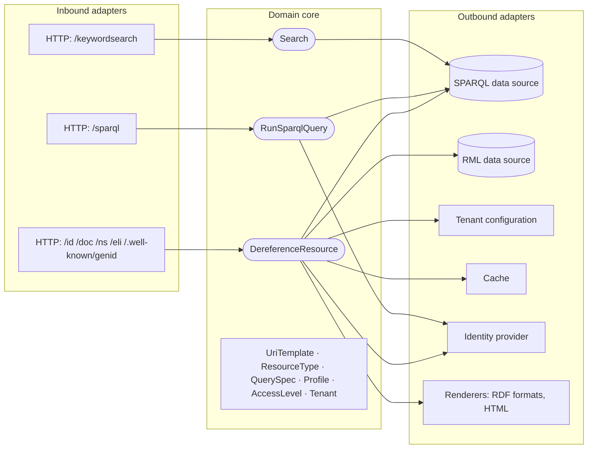

# Hexagonal design

SPieGeL uses a hexagonal architecture (ports and adapters). The domain core holds the rules that the predecessor spreads over scripts, templates and an XML catalogue. These rules include which URI template matches, which queries describe a resource, which profile applies, and which access level a caller has. The core depends only on interfaces (ports). Everything technology-specific lives in adapters.

!!! note "Status"
    This is the design as proposed by the analysis. Choices that need a formal decision will be recorded as [ADRs](../../adr/README.md).

The order in which these parts act on a request is described in [Request flow](request-flow.md).

## Domain core

| Concept | Responsibility |
|---|---|
| `Tenant` | A domain: host names, data sources, URI templates, profiles, HTML theme. |
| `UriTemplate` | A path pattern with typed variables, and the `ResourceType` it identifies. Also models the `id` → `doc` relation and the `303`. |
| `ResourceType` | What kind of resource a template yields, and which `QuerySpec`s describe it. |
| `QuerySpec` | A query (stored as data), the data source it runs on, and the conditions (profile, media type) under which it runs. Replaces the predecessor's XML query catalogue. |
| `Profile` | A named view of a resource (for example *summary* or *full*), negotiated per Content Negotiation by Profile. |
| `AccessLevel` | An ordered type (*public* < *internal* < *confidential* < *secret* < *top secret*). The caller's level is the highest level among their roles. |
| `ResourceDescription` | The merged RDF result, independent of format. |

Use cases (inbound ports):

- **`DereferenceResource`**: given a tenant, a path, the negotiated media type and profile, and the caller's access level, return a `ResourceDescription`, a redirect, or "not found".
- **`RunSparqlQuery`**: run a read-only query for a tenant at the caller's access level.
- **`Search`**: keyword search for a tenant.

Outbound ports:

| Port | Adapters |
|---|---|
| `DataSourcePort` | SPARQL over HTTP (Jena); later RML mappings over relational, file and Web API sources (see [open question 28](../06-open-questions.md#architecture-and-operations)) |
| `TenantConfigurationPort` | Files under version control (YAML for settings, `.rq` files for queries) |
| `CachePort` | In-memory; later a shared cache |
| `IdentityPort` | OIDC through Spring Security |
| `RendererPort` | Jena RIOT for RDF formats; a template engine for HTML |

## Mapping from the predecessor

| Predecessor concept | SPieGeL equivalent | Note |
|---|---|---|
| Java accessor | Adapter (inbound or outbound) | Usually a direct translation |
| Scripts for `/doc`, `/ns`, `/sparql` and search | Use cases in the core | Currently mix caching, security and domain logic; to be separated |
| Routes generated at runtime per domain | One set of controllers with `Tenant` resolved from the host name | No per-domain code |
| XML query catalogue and query templates | `ResourceType` + `QuerySpec` + `Profile` | The most hidden business logic of the predecessor. Now typed and tested |
| RDF serialisation | Renderer adapter (Jena RIOT) | — |
| XSLT HTML rendering | HTML renderer adapter | Template engine to be decided |
| File-based second-level cache | `CachePort` | The key includes the access level and profile (NFR-SEC-03) |
| OIDC flow scripts | Spring Security OAuth2 resource server / client | Large simplification |
| Environment variables → configuration | `@ConfigurationProperties` + tenant configuration files | — |
| Concurrency throttle | Bounded executor or bulkhead per data source | NFR-OPS-02 |

## Rules that keep the core clean

- The core has **no** dependency on Spring, servlet APIs, Jena's HTTP client or any template engine. It may use Jena's RDF model types, so that descriptions can be merged without conversion. (To be confirmed in an ADR.)
- Adapters depend on the core; the core never depends on adapters.
- Authorisation is part of the use case, not of a filter that can be bypassed by a cache hit (NFR-SEC-03).
