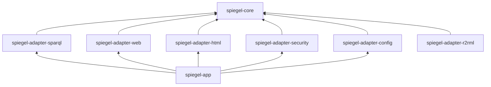

# Module structure

The proposed Maven module layout follows the [hexagonal design](hexagonal-design.md). Each adapter is its own module, so that its dependencies cannot leak into the core.

```
spiegel/                         (parent POM, packaging pom)
├── spiegel-core                 domain model, use cases, ports. No Spring.
├── spiegel-adapter-sparql       DataSourcePort over SPARQL 1.1 (Apache Jena)
├── spiegel-adapter-web          HTTP inbound: dereferencing, 303, content negotiation, /sparql
├── spiegel-adapter-html         RendererPort for HTML (template engine, Flux design system, front-end build)
├── spiegel-adapter-security     IdentityPort: OIDC, roles → AccessLevel
├── spiegel-adapter-config       TenantConfigurationPort: YAML + .rq files
├── spiegel-adapter-r2rml        DataSourcePort over R2RML (later)
└── spiegel-app                  Spring Boot application: wiring, caching, health, packaging
```

## Dependency rules



- `spiegel-core` depends on nothing in this project, and only on a minimal set of libraries.
- Adapters depend on `spiegel-core` only, never on each other.
- Only `spiegel-app` knows all modules. It is the only module that depends on Spring Boot's auto-configuration.
- These rules are enforced by a test (for example with ArchUnit), not only by convention.

## Why this split

The modules are a direct consequence of the [hexagonal design](hexagonal-design.md): one module for the core, one per adapter, and one that assembles them. Separate Maven modules, rather than packages in one module, are chosen for these reasons:

1. **The compiler guards the boundaries.** A module can only use what its own POM declares. Jena is only in `spiegel-adapter-sparql`, and Spring MVC only in `spiegel-adapter-web`. The core cannot import a Spring or Jena HTTP class by accident, because it would not compile. With packages in one module, such a boundary is only a convention.
2. **A test guards what the compiler cannot see.** `ArchitectureTest` (ArchUnit) checks on every build that the core stays free of frameworks and that adapters do not depend on each other.
3. **Adapters can be replaced.** A relational source arrives as a second implementation of the same `DataSourcePort` (`spiegel-adapter-r2rml`), without any change to the core. The same holds for the template engine, which is still to be chosen ([open question 9](../06-open-questions.md#front-end)).
4. **The core can be tested without infrastructure.** The rules for URI templates, profiles, access levels and merging descriptions are tested without a server, a store or a browser (NFR-Q-01, NFR-Q-02).
5. **Each technology stays in its own module.** This matters especially for `spiegel-adapter-html`, which gets a front-end build (Node.js, pnpm, Flux; see [Design system: Flux](../03-requirements/design-system.md#consequences-for-the-design)) that must not leak into the rest of the build.
6. **Modules arrive by phase.** Phase 1 needs no authentication, so `spiegel-adapter-security` arrives in phase 2 ([ADR 0004](../../adr/0004-technology-baseline.md): modules are added when they are needed).
7. **It prevents what the predecessor shows.** There, caching, security and domain logic are mixed in scripts, and the query catalogue lives outside any type system or test (see [Mapping from the predecessor](hexagonal-design.md#mapping-from-the-predecessor)). Module boundaries keep these concerns apart.

The split has costs:
- **More build files.** There are more POMs and some boilerplate.
- **Some concerns cross modules.** The cache lives in `spiegel-app` but must follow the core's rules (NFR-SEC-03), and logging must be consistent in every module.
- **One boundary is still open:** whether the core may use Jena's RDF model types, to merge descriptions without conversion ([open question 14](../06-open-questions.md#architecture-and-operations)). If so, `spiegel-core` gains a dependency on `jena-core`, but still none on Jena's HTTP client.

## Phase 1 subset

Phase 1 (see [Scope](../01-context/scope.md#phasing)) needs `spiegel-core`, `spiegel-adapter-sparql`, `spiegel-adapter-web`, `spiegel-adapter-html`, `spiegel-adapter-config` and `spiegel-app`. `spiegel-adapter-security` arrives in phase 2, and `spiegel-adapter-r2rml` later.

## Group and artefact identifiers

Decided in [ADR 0004](../../adr/0004-technology-baseline.md): group `be.vlaanderen.omgeving.spiegel`, artefacts as listed above, with `spiegel-parent` as the parent POM.
