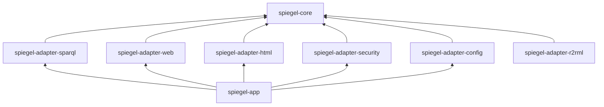

# Module structure

The proposed Maven module layout follows the [hexagonal design](hexagonal-design.md). Each adapter is its own module, so that its dependencies cannot leak into the core.

```
spiegel/                         (parent POM, packaging pom)
├── spiegel-core                 domain model, use cases, ports. No Spring.
├── spiegel-adapter-sparql       DataSourcePort over SPARQL 1.1 (Apache Jena)
├── spiegel-adapter-web          HTTP inbound: dereferencing, 303, content negotiation, /sparql
├── spiegel-adapter-html         RendererPort for HTML (template engine, design system)
├── spiegel-adapter-security     IdentityPort: OIDC, roles → AccessLevel
├── spiegel-adapter-config       TenantConfigurationPort: YAML + .rq files
├── spiegel-adapter-r2rml        DataSourcePort over R2RML (later)
└── spiegel-app                  Spring Boot application: wiring, caching, health, packaging
```

## Dependency rules



- `spiegel-core` depends on nothing in this project, and only on a minimal set of libraries.
- Adapters depend on `spiegel-core` only, never on each other.
- Only `spiegel-app` knows all modules. It is the only module that depends on Spring Boot's auto-configuration.
- These rules are enforced by a test (for example with ArchUnit), not only by convention.

## Phase 1 subset

Phase 1 (see [Scope](../01-context/scope.md#phasing)) needs `spiegel-core`, `spiegel-adapter-sparql`, `spiegel-adapter-web`, `spiegel-adapter-html`, `spiegel-adapter-config` and `spiegel-app`. `spiegel-adapter-security` arrives in phase 2, and `spiegel-adapter-r2rml` later.

## Group and artefact identifiers

Decided in [ADR 0004](../../adr/0004-technology-baseline.md): group `be.vlaanderen.omgeving.spiegel`, artefacts as listed above, with `spiegel-parent` as the parent POM.
