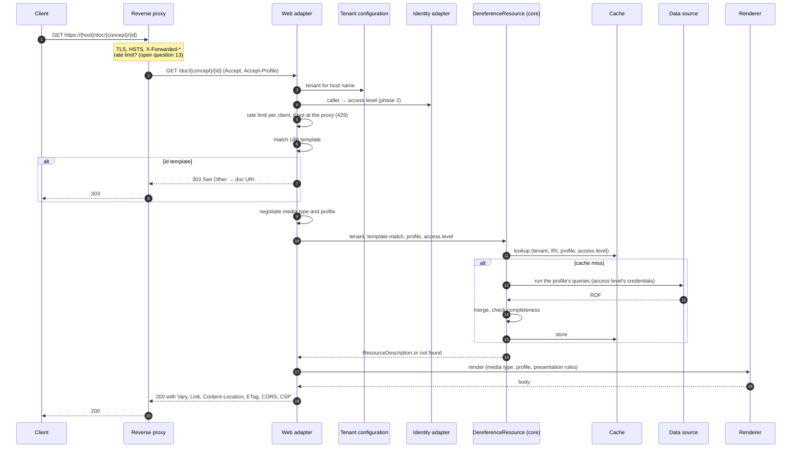

# Request flow

This chapter follows a request through SPieGeL, from arrival to response. It complements the [hexagonal design](hexagonal-design.md), which lists the parts, by fixing **the order in which they act**. For each step it says which part acts and which requirements it covers. The predecessor's flow is described in [Request flows](../02-current-platform/request-flows.md).

!!! note "Status"
    This is the flow as proposed by the analysis. Steps that depend on an open choice say so and link to the [open questions](../06-open-questions.md). Steps marked *phase 2* do not exist in phase 1, where every caller is unauthenticated and so has the *public* access level (see [Scope](../01-context/scope.md#phasing)).

## Principles behind the order

1. **Cheap decisions first.** Tenant, URI template, `303` and content negotiation need no data, so they come before any query.
2. **Authorise before the cache.** The caller's access level is known before the cache is consulted, and it is part of the cache key (NFR-SEC-03).
3. **Data before format.** The core produces a format-independent `ResourceDescription`. Media type and HTML presentation are applied after the cache, so one cached description serves every format of the same profile.
4. **Fail closed.** A resource that does not exist and one the caller may not see give the same answer (NFR-SEC-07). An incomplete description is never cached or served as if it were complete.

## Dereferencing a resource: `/id`, `/doc`, `/ns`, Skolem IRIs and ELI

### Steps

| # | Step | Part | Requirements |
|---|---|---|---|
| 0 | **Edge.** The reverse proxy terminates TLS, adds HSTS and passes the original host and scheme in `X-Forwarded-*` headers. SPieGeL trusts those headers only from the proxy. Which other concerns stay at the edge (the `303`, CORS, input filtering, rate limiting) is [open question 13](../06-open-questions.md#architecture-and-operations). | reverse proxy | NFR-OPS-08 |
| 1 | **Receive.** Assign a request identifier, start timing, and log in a structured format. | web adapter | NFR-OPS-05 |
| 2 | **Resolve the tenant** from the host name. An unknown host gets `404`. | web adapter, `TenantConfigurationPort` | FR-MT-01, FR-MT-02 |
| 3 | **Identify the caller** *(phase 2)*. A bearer token (OpenID Connect or client credentials) is validated on every request, with no server-side session. A caller without a token is an unauthenticated client and gets the *public* level, the lowest. In phase 1 every caller is one. The level is the highest one granted by the caller's roles. | web adapter, `IdentityPort` | FR-AC-01, FR-AC-02, NFR-OPS-01 |
| 3a | **Check the rate limit** for this client, tenant and kind of request, unless the proxy already does so (step 0). Over the limit gives `429` with `Retry-After` (step E7). No query has been run yet. A limit per authenticated client can only be applied after step 3. | web adapter or reverse proxy | NFR-OPS-08 |
| 4 | **Match the URI template.** When several match, the most specific wins: more literal characters, then more variables. Variables are typed and validated, so an invalid value gives `404` (no match), not an error. No match gives `404`. | core (`UriTemplate`) | FR-URI-01, FR-URI-03 to 05 |
| 5 | **`id` → `doc`.** If the template is an `id` template, answer `303 See Other` with the matching `doc` URI in `Location`, for every media type. The data is not consulted, so the redirect reveals nothing about whether the resource exists or is visible. | core (`UriTemplate`), web adapter | FR-URI-02, NFR-SEC-07 |
| 6 | **Negotiate the media type.** A format suffix or `_format` overrides `Accept`. Nothing acceptable gives `406`. | web adapter | FR-CN-01, FR-CN-02, FR-CN-05 |
| 7 | **Negotiate the profile.** `_profile` overrides `Accept-Profile`. If nothing is asked for, or the request cannot be met, the resource type's default profile *for this media type* applies, for example a lighter HTML profile. The response says which profile was used. | core (`Profile`) | FR-CN-03 |
| 7a | **Choose the language** for HTML: `?lang=`, then `Accept-Language`, then the tenant's default, among the languages the tenant offers. It affects rendering only, not the queries or the cache. | web adapter | FR-HTML-12 |
| 8 | **Call the use case** `DereferenceResource` with the tenant, the template match (resource IRI and type), the profile and the access level. | web adapter → core | — |
| 9 | **Select the queries.** Those `QuerySpec`s of the resource type whose conditions hold for the profile. The conditions are typed and tested. | core (`ResourceType`, `QuerySpec`) | FR-RA-01 to 03 |
| 10 | **Look up the cache** under (tenant, resource IRI, profile, access level). The media type is not part of the key, because the cache holds RDF. | core → `CachePort` | NFR-SEC-03, NFR-OPS-03 |
| 11 | **Run the queries** on a miss, on each query's named data source, with the credentials for the caller's access level. The resource IRI is bound as a term, not pasted into text. Queries run concurrently, within a bounded pool per data source and with a timeout. | core → `DataSourcePort` | FR-DS-01, FR-AC-03, NFR-SEC-02, NFR-SEC-04, NFR-OPS-02 |
| 12 | **Merge and check.** Merge the results into one `ResourceDescription`, with blank nodes to the configured depth and `owl:unionOf` lists expanded for vocabularies. If a query failed or timed out, the request fails (step E2), and nothing is cached. If the description is empty, the result is *not found*: the resource does not exist, or the caller may not see it. | core | FR-RA-01, FR-RA-04, FR-RA-05, FR-URI-06, NFR-SEC-07 |
| 13 | **Store** a complete description in the cache, with the tenant's expiry time. | core → `CachePort` | NFR-OPS-03 |
| 14 | **Render.** For RDF formats, serialise with Jena RIOT, streaming where possible. For HTML, see [Rendering HTML](#rendering-html). | `RendererPort` | FR-CN-01, FR-HTML-01 |
| 15 | **Set the headers** and send the response. See [Response headers](#response-headers). | web adapter | FR-CN-04, NFR-OPEN-01, NFR-UI-03 |
| 16 | **Log and measure:** status, duration, and cache hit or miss, per tenant and data source. | web adapter | NFR-OPS-05 |

A conditional request (`If-None-Match`) whose `ETag` still matches gets `304 Not Modified` after step 13, without rendering.

### Rendering HTML

HTML is rendered from the same `ResourceDescription`, after the cache. The steps are:

1. **Labels.** Labels of the properties and of the linked resources, and their types, must be present, because every IRI on the page becomes a link labelled with its label (FR-HTML-10). Labels of external vocabularies come from the configured label sources (FR-HTML-11). They come from a query that the HTML profile declares for that purpose, not from whatever the main queries happen to return (see [Data-dependent HTML rendering](../02-current-platform/html-rendering.md#observations)).
2. **Presentation rules.** The tenant's rules, combined with the shared defaults, choose the presentation blocks and components: by type, by predicate, by the predicate's own type and by datatype. → FR-HTML-06. How the rules are expressed is [open question 21](../06-open-questions.md#front-end).
3. **Geometries.** WKT literals are written into the page as they are, with their CRS (the GeoSPARQL CRS IRI, or WGS84 when there is none). The geometry map component reads them from the page and reprojects them in the browser. The server does no conversion, and the map needs no follow-up request. → FR-HTML-07.
4. **Template.** A template per URI template or resource type, falling back to the generic subject page, writes Flux markup with the content inside the tags (in the light DOM or in slots), so that the page is readable without JavaScript. → FR-HTML-03, NFR-UI-01, NFR-UI-04, [Design system: Flux](../03-requirements/design-system.md). The template engine is [open question 9](../06-open-questions.md#front-end).
5. **Interactive parts** are placeholders that the browser fills later, with follow-up requests (see [below](#follow-up-requests-from-the-browser)): incoming relations, trees, collection tables, and the map's interaction.

### Response headers

| Header | When | Value | Requirement |
|---|---|---|---|
| `Content-Type` | always | the negotiated media type | FR-CN-01 |
| `Content-Language` | HTML | the chosen interface language | FR-HTML-12 |
| `Vary` | when the format, profile or language was negotiated from headers | `Accept`, `Accept-Profile`, `Accept-Language` (HTML, when no `?lang=` is given) and, in phase 2, `Authorization`. Omitted for a suffix or `_format`, whose URL already fixes the format | NFR-SEC-03 |
| `Content-Location` | when negotiated | the format-specific URL, for example `/doc/x.ttl` | FR-CN-02 |
| `Link` | always | `rel="alternate"` per format and profile; `rel="profile"` for the profile used | FR-CN-03, FR-CN-04 |
| `ETag`, `Cache-Control` | `200` and `304` | a hash of the description and the variant; the tenant's expiry. `private` for non-public access levels | NFR-OPS-03, NFR-SEC-03 |
| `Access-Control-Allow-Origin` | public responses | `*`. Credentialed requests follow normal CORS rules | NFR-OPEN-01 |
| `Content-Security-Policy` | HTML | as strict as Flux allows | NFR-UI-03 |

### Errors

| Situation | Status | Note |
|---|---|---|
| E1. Unknown host, no matching template, or a resource that does not exist or may not be seen | `404` | One answer for all of these (NFR-SEC-07). HTML through `vl-http-error-message`. |
| E2. Data source error | `502` | Nothing is cached. The body does not include the store's error message or the query text. |
| E3. Data source timeout | `504` | As E2. |
| E4. Pool or queue full for a data source | `503` with `Retry-After` | NFR-OPS-02. Concerns the service as a whole, unlike E7. |
| E5. No acceptable media type | `406` | FR-CN-05. |
| E6. Requested profile not available | `200` with the default profile | Allowed by Content Negotiation by Profile. The `Link` header names the profile actually used. |
| E7. Client over its rate limit | `429` with `Retry-After` | NFR-OPS-08. Checked at step 3a, before any query. Unlike `503`, it concerns one client, not the service. |

## `/sparql`

1. Steps 1 to 3a as above: receive, resolve the tenant, identify the caller, and check the rate limit, which is stricter for `/sparql` (NFR-OPS-08).
2. **Read the query** from `query` (GET, or a `POST` form) or from a `POST` body of type `application/sparql-query`. Without a query, use the tenant's default query (FR-SPARQL-04).
3. **Parse it with Jena.** Anything other than `SELECT`, `CONSTRUCT`, `ASK` or `DESCRIBE` is rejected with `400`. That is defence in depth: read-only access is guaranteed by the store's credentials (NFR-SEC-01).
4. **Run it** on the tenant's data source with the credentials for the caller's access level, within the same bounded pool, and with a timeout and a result limit (FR-AC-03, NFR-OPS-02).
5. **Negotiate the result format.** One of the standard result formats, by content negotiation, with SPARQL JSON as the default for `SELECT` and `ASK` (FR-SPARQL-02), or an HTML table with clickable IRIs for browsers (FR-SPARQL-03).
6. **Respond** with CORS for public use (NFR-OPEN-01). Results are not cached by default.

## Follow-up requests from the browser

The interactive components (incoming relations, hierarchy tree, collection table) request more data after the page has loaded. A map of the resource's own geometries does not: its data is already in the page. A map of many resources, for example all members of a collection, does. There are two candidate routes ([open question 24](../06-open-questions.md#front-end)):

- **Through `/sparql`**, as the predecessor's components do. The queries live in the browser and follow the `/sparql` flow, uncached.
- **Through small endpoints per function**, for example a count of incoming relations per predicate, a page of subjects, or the children of a tree node. Their queries are tenant configuration, like any `QuerySpec`. They follow the same steps as dereferencing (tenant, identity, cache with access level in the key, bounded queries), and return JSON.

## Front page and keyword search

- **Front page** (FR-HTML-02, FR-HTML-09): `GET /` on a tenant's host name. Steps 1 and 2 select the tenant from the host, so every host name, such as `data.imjv.omgeving.vlaanderen.be` or `data.bodemenondergrond.vlaanderen.be`, gets its own front page. The page is built from **discovery blocks**: the tenant's block queries (by default DCAT catalogues with their datasets, SKOS concept schemes, and `rdfs:Class` and `owl:Class`) run like any `QuerySpec`, at the *public* access level, bounded, with a timeout, and cached (steps 9 to 13). The template renders the non-empty blocks after an optional configured introduction, example queries and search terms. If one block fails, the page shows the other blocks and says that one could not be loaded. Unlike a resource description, a front page is a list of independent blocks. An unknown host gets `404`, as in step 2.
- **Portal page** (FR-HTML-08): the front page of the umbrella tenant (`algemeen`) also lists every published domain and links to its front page. The list is discovered from the tenant configuration (all tenants), from the actual publication (a query on the umbrella domain's open data catalogue), or from both, merged with configured entries for domains published elsewhere. Which source is used is [open question 25](../06-open-questions.md#front-end).
- **Keyword search** (FR-SRCH-01): steps 1 to 3, then two queries through the search port (a count, then a page of results) with the same bounds and timeouts, rendered as a list. Whether it stays is [open question 4](../06-open-questions.md#product-and-scope).

## Choices this chapter makes

These follow from the requirements, but deserve confirmation in an ADR when the code is written:

- The `303` does not check whether the resource exists (step 5).
- The media type is not part of the cache key; the profile is (step 10).
- A partial result is an error, never a partial page (step 12).
- Labels for HTML come from a query declared by the HTML profile (rendering step 1).

Related open questions: edge concerns such as the `303` and HSTS ([13](../06-open-questions.md#architecture-and-operations)), Jena model types in the core ([14](../06-open-questions.md#architecture-and-operations)), generated versus hand-written queries ([19](../06-open-questions.md#architecture-and-operations)), presentation rules ([21](../06-open-questions.md#front-end)), and follow-up requests ([24](../06-open-questions.md#front-end)).
